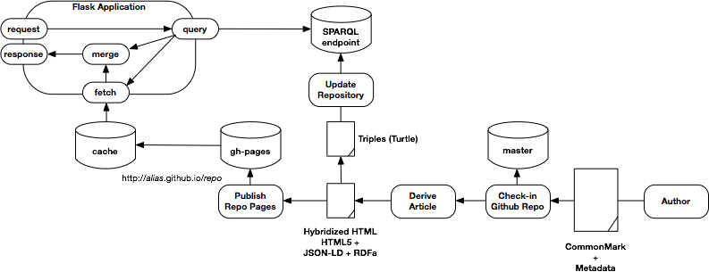

# duckpond

A semantic pond for content delivery.

## Introduction

A [semantic data lake](http://cacm.acm.org/news/200095-the-data-lake-concept-is-maturing/fulltext) can be thought of a set of resources annotated with semantics (i.e., triples or quads).  In the context of big data, a "data lake" is a massive repository of data, structured or unstructured, of which we gain knowledge of its contents by examining the semantic graphs derived from their contents.

That's a big idea.  This project is about a *semantic data lake* at a much smaller scale: a pond. I also like ducks and so it is a *duck pond*.

We can paddle around in our content, just like a duck, and harvest a bit knowledge to derive local value.  In this case, we use the semantic pond to understand the content, its inter-relations, ordering, and other such content relations.  From that, we can derive a useful presentation on the Web.

The architecture also utilizes Github as a basis for publishing.  That is not a requirement but it lessens the infrastructure and allows me to keep revision histories and all the other goodies that come with git and Github.

## Demonstrations

I use this technology to run my wee website: [my corner of the web](http://www.milowski.com/).

You can see the raw markdown/commonmark source in the [Github project (milowski-journal)](https://github.com/alexmilowski/milowski-journal/tree/master/entries) and various post-processed articles on the `github.io` pages (e.g., [source markdown](https://github.com/alexmilowski/milowski-journal/blob/master/entries/2016-05-24/xmlprague-2014.md) and [rendered content](http://alexmilowski.github.io/milowski-journal/2016-05-24/xmlprague-2014.html)).  Note that the rendered content is just the HTML `article` element and, as such, it doesn't render with all the website style information.  That is the purpose of the Flask application (i.e., see the [web rendering](http://www.milowski.com/journal/entry/2016-05-24T13:25:00-08:00/)).

## Status

This is a work in progress and I'm still refactoring all the goodies out of my web application.  At some point in the near future I intend to provide a sample flask application so you can see how it all works.

Here are some ideas that I'm working on:

 * defining ordering facets for various types of content (e.g., a article of type http://schema.org/BlogPosting has ordering facets)
 * allow a galley of content to be defined by a semantic graph
 * allow partitioning of a galley of content into "pages" to be defined by a semantic graph
 * use SPARQL queries to load definitions of web resources based on galley and partitioning graphs

Essentially, I'm trying to make the demonstration web application able to load some of the site page structure from the same semantic pond; more ducks paddling around in the data.
